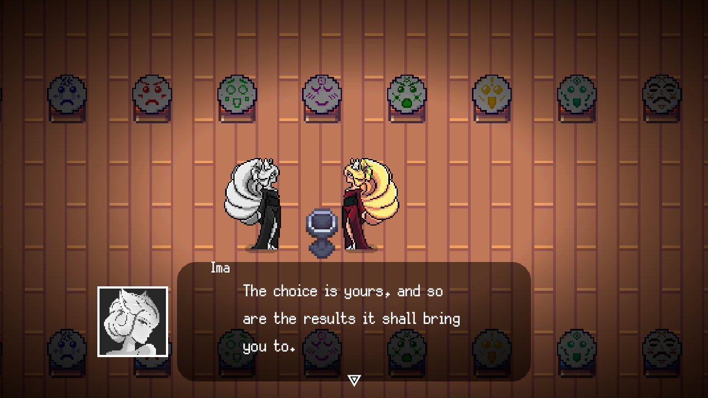

# Tsumi

A video game made in the Bevy game engine for the [Pirate Software Game Jam 15](https://itch.io/jam/pirate). It's a short narrative driven game in which you combine emotions to trigger different kinds of dialogue.

    

## Appendix

[Credits](https://github.com/PraxTube/tsumi/blob/master/CREDITS.md).

[License](https://github.com/PraxTube/tsumi/blob/master/LICENSE),
applies to everything that doesn't already have a license.
